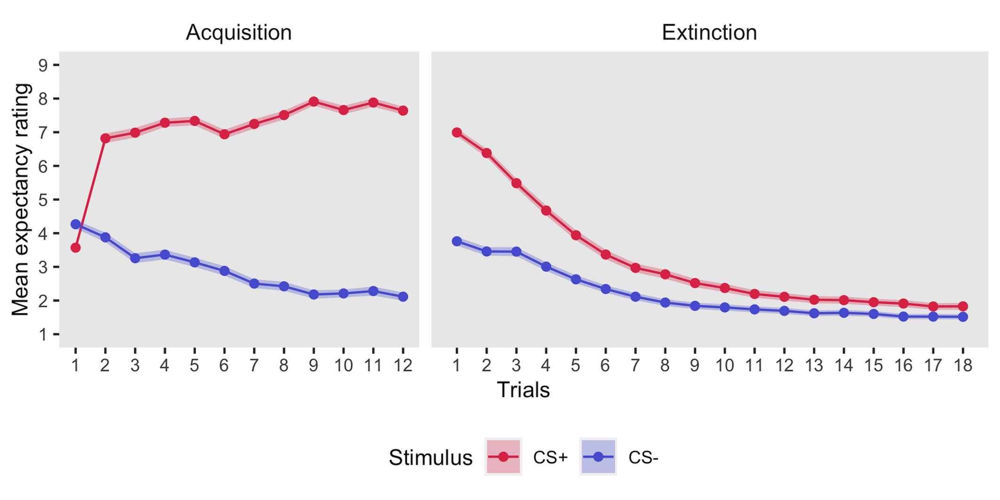

```{r setup, include=FALSE}
knitr::opts_chunk$set(echo = FALSE)
```

```{r load packages, include=FALSE}
library(tidyverse) # data manipulation
library(here) # file referencing
library(ComplexUpset) # creating upset plots
library(gt) # creating tables
library(webshot) # required for saving gt tables
```

```{r read in dataset, include=FALSE}
flare_data <- read_rds(here("data", "processed", "flare-data.Rds")) %>% 
  filter(started_app == TRUE)
```

# Introduction

Descriptive analyses for the FLARe dataset collected as part of the PORT study.

Exclusions have not been applied and missing data has not been imputed at this stage.

# Pre-registered exclusions

The following exclusion criteria related to FLARe performance were submitted in the preregistration:

-   Self-reporting that they did not follow the instructions properly for the fear conditioning task (i.e. removed their headphones, did not pay attention, were interrupted)
-   Self-reporting that they did not find the aversive stimulus unpleasant (i.e. a rating of five out of ten or lower)
-   Missing six or more trial ratings during the acquisition or extinction phase of the fear conditioning task
-   Having an average device volume of 50% or lower during the acquisition phase of the fear conditioning task

```{r preregistered exclusions wrangling, include=FALSE}
# Recode variables so that TRUE is always a response that leads to exclusion
exclusions <- flare_data %>% 
  transmute( # Transmute so that only relevant variables are kept
    did_not_follow_instructions = if_else(did_follow_instructions == TRUE, FALSE, TRUE),
    did_remove_headphones,
    did_not_pay_attention = if_else(did_pay_attention == TRUE, FALSE, TRUE),
    completed_in_public = if_else(task_environment == "private", FALSE, TRUE),
    loud_environment = if_else(was_quiet == TRUE, FALSE, TRUE),
    not_alone,
    was_interrupted,
    us_not_aversive = if_else(us_unpleasantness_rating <= 5, TRUE, FALSE),
    excessive_missed_trials = if_else(missing_exp_acquisition >= 6 | missing_exp_extinction >= 6, TRUE, FALSE),
    volume_exclusion_50pct_acquisition
  )
```

```{r preregistered exclusions upset plot, warning=FALSE}
# Warnings silenced to prevent upset plot warning about missing values

# Save a vector of variable names (i.e. the types of self reported exclusions) to use as the 'intersect' argument in upset
exclusion_variables <- names(exclusions)

# Create upset plot
upset(exclusions, 
      intersect = exclusion_variables,
      name = "Exclusions by frequency (n = 271)")

# Save last plot
# Suppress messages to prevent 'saving' message
suppressMessages(ggsave(filename = "upset-plot_exclusions.pdf", plot = last_plot(), path = here("reports", "figures")))
```

```{r preregistered exclusions table}
# Create table using gt
exclusions_table <- exclusions %>% 
  summarise(across(everything(.), ~sum(., na.rm = T))) %>% 
  pivot_longer(cols = everything(), 
               names_to = "Instructions violation", 
               values_to = "Number reporting") %>%
  arrange(desc(`Number reporting`)) %>% 
  mutate(`Instructions violation` = str_to_sentence(str_replace_all(`Instructions violation`, "_", " "))) %>% 
  gt() %>% 
   tab_header(
    title = md("**Number of participants that self-reported each type of instructions violation**"),
    subtitle = "The same participant may have reported not following more than one instruction"
  )

# Print and save table
exclusions_table
gtsave(exclusions_table, filename = "exclusions-table.pdf", path = here("reports", "tables"))

# Calculate the total number of excluded participants under the preregistered criteria
exclusions <- exclusions %>% 
  mutate(flare_exclusion = if_else(rowSums(., na.rm = T) >= 1, TRUE, FALSE))
```

# Potential exclusions

List of other variables that could potentially indicate that participants did not complete the FLARe task properly:

-   `rating_delay_min_flag` - Participant responded to an expectancy rating before the 3 second rating delay

-   `rating_delay_max_flag` - Participant responded to an expectancy rating after the 8 second trial time

-   `trial_delay_flag` - The maximum trial delay is greater than the length of two trials (22 seconds)

-   `break_length_flag` - A break of 20 minutes or longer

-   `fc_duration_flag` - Length of task was 40 minutes or more

-   `headphones_disconnected` - Headphones disconnected at least once during the task

-   `exited_app` - Exited the app at least once during the task

```{r potential exclusions wrangling, include=FALSE, message=FALSE}
# Get the column indicating which participants are excluded under the preregistered exclusions list
preregistered_exclusions <- exclusions %>% 
  pull(flare_exclusion)

# Recode variables so that TRUE is always a response that leads to exclusion
potential_exclusions <- flare_data %>% 
  transmute( # Transmute so that only relevant variables are kept
    rating_delay_min_flag,
    rating_delay_max_flag,
    trial_delay_flag,
    break_length_flag = if_else(break_length_mins >= 20, TRUE, FALSE),
    fc_duration_flag = if_else(fc_duration_mins >= 40, TRUE, FALSE),
    headphones_disconnected = if_else(headphone_disconnects_total >= 1, TRUE, FALSE),
    exited_app = if_else(exits_total >= 1, TRUE, FALSE)
  ) %>% 
  # Add and rename the column of preregistered exclusions
  bind_cols(preregistered_exclusions) %>% 
  rename(preregistered_exclusions = `...8`)
```

```{r potential exclusions upset plot, warning=FALSE}
# Save a vector of variable names (i.e. the types of self reported exclusions) to use as the 'intersect' argument in upset
potential_exclusion_variables <- names(potential_exclusions)

# Create upset plot
upset(potential_exclusions, 
      intersect = potential_exclusion_variables,
      name = "Exclusions by frequency (n = 271)")

# Save last plot
suppressMessages(ggsave(filename = "upset-plot_potential-exclusions.pdf", plot = last_plot(), path = here("reports", "figures")))
```

```{r potential exclusions table}
# Create table using gt
potential_exclusions_table <- potential_exclusions %>% 
  summarise(across(everything(.), ~sum(., na.rm = T))) %>% 
  pivot_longer(cols = everything(), names_to = "Instructions violation", values_to = "Number reporting") %>%
  arrange(desc(`Number reporting`)) %>% 
  mutate(`Instructions violation` = str_to_sentence(str_replace_all(`Instructions violation`, "_", " "))) %>% 
  gt() %>% 
   tab_header(
    title = md("**Number of participants that self-reported each type of instructions violation**"),
    subtitle = "The same participant may have reported not following more than one instruction"
  )

# Print and save table
potential_exclusions_table
gtsave(potential_exclusions_table, filename = "potential-exclusions-table.pdf", path = here("reports", "tables"))

# Calculate the total number of excluded participants under the preregistered criteria
potential_exclusions <- potential_exclusions %>% 
  mutate(potential_flare_exclusion = if_else(rowSums(., na.rm = T) >= 1, TRUE, FALSE))
```

```{r}
flare_exclusions <- potential_exclusions %>% 
  select(headphones_disconnected, exited_app, preregistered_exclusions) %>% 
  transmute(flare_exclusion = if_else(rowSums(., na.rm = T) >= 1, TRUE, FALSE)) %>% 
  pull()
```

# Variable exploration

## Headphone removal

```{r headphone removal table}
headphone_removal_table <- flare_data %>% 
  select(did_remove_headphones, headphones_removal_point) %>% 
  filter(did_remove_headphones == TRUE) %>% 
  count(headphones_removal_point) %>% 
  mutate(headphones_removal_point = str_to_sentence(str_replace_all(headphones_removal_point, "_", " "))) %>% 
  rename(`Headphones removal point` = headphones_removal_point,
         `Number reporting` = n) %>% 
  gt() %>%
  tab_header(title = md("**Point at which participants self-reported removing their headphones**"))

headphone_removal_table
gtsave(headphone_removal_table, filename = "headphone-removal-table.pdf", path = here("reports", "tables"))
```

## US aversiveness

```{r}
us_aversiveness <- flare_data %>% 
  mutate(us_not_aversive = ifelse(
    test = us_unpleasantness_rating <= 5, 
    yes = TRUE, 
    no = FALSE
  ))


```

# Elephant plots

```{r Elephant wrangling, include=FALSE}
# Create a list of expectancy rating trial variables
elephant_long <- flare_data %>% 
  select(starts_with("exp_")) %>%
  mutate(n = nrow(.)) %>% 
  pivot_longer(cols = -n, names_to = "variable", values_to = "rating") %>% 
  mutate(variable = str_remove(variable, "exp_")) %>%
  separate(variable, into = c("phase", "cs", "stimulus", "trial"), sep = "_") %>% 
  select(-cs) %>% 
  mutate(trial = as.numeric(trial)) %>% 
  group_by(phase, stimulus, trial) %>% 
  summarise(mean = mean(rating, na.rm = T), std_dev = sd(rating, na.rm = T), n = mean(n), .groups = "keep") %>% 
  mutate(sem = std_dev / sqrt(n),
         ci_low = mean - 2*(sem),
         ci_high = mean + 2*(sem)) %>% 
  ungroup() %>% 
  mutate(Phase = str_to_sentence(phase),
         Phase = factor(Phase, levels = c("Acquisition", "Extinction")),
         Stimulus = factor(stimulus, levels = c("plus", "minus")),
         Stimulus = fct_recode(Stimulus, "CS+" = "plus", "CS-" = "minus")) %>% 
  select(Phase, Stimulus, Trial = trial, everything()) %>% 
  select(-c(phase, stimulus)) %>% 
  arrange(Phase, Stimulus, Trial)

# Function for breaks
breaks_fun <- function(x) {
  if (max(x) > 12) {
    seq(0, 18, 1)
  } else {
    seq(0, 12, 1)
  }
}


flare_data_clean <- flare_data %>% 
  cbind(flare_exclusions) %>% 
  filter(flare_exclusions != 1)

# Create a list of expectancy rating trial variables
elephant_long_clean <- flare_data_clean %>% 
  select(starts_with("exp_")) %>%
  mutate(n = nrow(.)) %>% 
  pivot_longer(cols = -n, names_to = "variable", values_to = "rating") %>% 
  mutate(variable = str_remove(variable, "exp_")) %>%
  separate(variable, into = c("phase", "cs", "stimulus", "trial"), sep = "_") %>% 
  select(-cs) %>% 
  mutate(trial = as.numeric(trial)) %>% 
  group_by(phase, stimulus, trial) %>% 
  summarise(mean = mean(rating, na.rm = T), std_dev = sd(rating, na.rm = T), n = mean(n), .groups = "keep") %>% 
  mutate(sem = std_dev / sqrt(n),
         ci_low = mean - 2*(sem),
         ci_high = mean + 2*(sem)) %>% 
  ungroup() %>% 
  mutate(Phase = str_to_sentence(phase),
         Phase = factor(Phase, levels = c("Acquisition", "Extinction")),
         Stimulus = factor(stimulus, levels = c("plus", "minus")),
         Stimulus = fct_recode(Stimulus, "CS+" = "plus", "CS-" = "minus")) %>% 
  select(Phase, Stimulus, Trial = trial, everything()) %>% 
  select(-c(phase, stimulus)) %>% 
  arrange(Phase, Stimulus, Trial)

# Function for breaks
breaks_fun <- function(x) {
  if (max(x) > 12) {
    seq(0, 18, 1)
  } else {
    seq(0, 12, 1)
  }
}
```

```{r Elephant plot}
elephant_plot_whole_sample <- elephant_long %>% 
  ggplot(aes(x = Trial, y = mean, color = Stimulus)) +
  geom_point() +
  geom_line() +
  geom_ribbon(aes(ymin = ci_low, ymax = ci_high, fill = Stimulus),
              linetype = 0,
              alpha = 0.3,
              size = 0.8
  ) +
  scale_fill_manual(values = c("#DF3B57", "#5762D5")) +
  scale_colour_manual(values = c("#DF3B57", "#5762D5")) +
  facet_grid(~ Phase, 
               scales = "free_x",
               space = "free_x"
    ) +
    # adjust the labels
    labs(y="Mean expectancy rating", 
         x = "Trials"
    ) +
    theme(strip.background = element_blank(),
          panel.grid.major = element_blank(),
          panel.grid.minor = element_blank(),
          legend.position = 'bottom',
          text = element_text(size = 10),
          strip.text.x = element_text(size = 10)
    ) +
    scale_x_continuous(breaks = breaks_fun) +
    scale_y_continuous(breaks = seq(0, 10, by = 1), limits = c(1, 9))

# Save
ggsave(
  file = paste0(here("reports", "figures"), "/elephant-plot_whole-sample.png"), 
  plot = elephant_plot_whole_sample, 
  width = 16, 
  height = 8, 
  units = "cm"
  )
```



```{r}
elephant_plot_exclusions_applied <- elephant_long_clean %>% 
  ggplot(aes(x = Trial, y = mean, color = Stimulus)) +
  geom_point() +
  geom_line() +
  geom_ribbon(aes(ymin = ci_low, ymax = ci_high, fill = Stimulus),
              linetype = 0,
              alpha = 0.3,
              size = 0.8
  ) +
  scale_fill_manual(values = c("#DF3B57", "#5762D5")) +
  scale_colour_manual(values = c("#DF3B57", "#5762D5")) +
  facet_grid(~ Phase, 
               scales = "free_x",
               space = "free_x"
    ) +
    # adjust the labels
    labs(y="Mean expectancy rating", 
         x = "Trials"
    ) +
    theme(strip.background = element_blank(),
          panel.grid.major = element_blank(),
          panel.grid.minor = element_blank(),
          legend.position = 'bottom',
          text = element_text(size = 10),
          strip.text.x = element_text(size = 10)
    ) +
    scale_x_continuous(breaks = breaks_fun) +
    scale_y_continuous(breaks = seq(0, 10, by = 1), limits = c(1, 9))

# Save
ggsave(
  file = paste0(here("reports", "figures"), "/elephant-plot_exclusions-applied.png"), 
  plot = elephant_plot_exclusions_applied, 
  width = 16, 
  height = 8, 
  units = "cm"
  )
```
